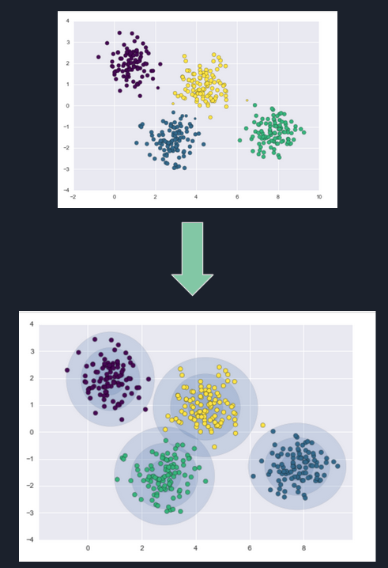
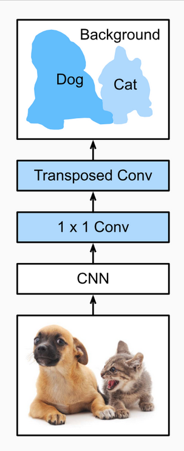
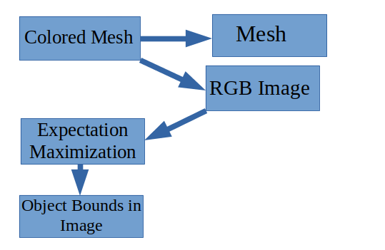
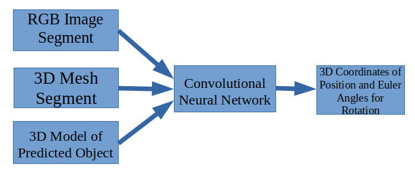

Machine Learning Research for Colored Meshes
============================================

Introductions
-------------
This semester, I, Andrew Knee, worked with Vishweshwar Ramanakumar under the supervision of Marshall Rawson with the main goal of exploring the utility of machine learning models in improving real time processing of image data. 
After looking through multiple models, we landed on 3 in particular: the Expectation Maximization (EM) algorithm, Convolutional Neural Networks (CNNs), and Fully Convolutional Networks.

Expectaion Maximization
-----------------------
The EM algorithm is an unsupervised machine learning method (unlabeled data) that in certain forms can perform both clustering and density estimation of data points. The main goal of the EM algorithm is to help classify data by estimating parameters known as latent variables, which are features of data not readily observed. 

The particular application of the EM model we felt would be useful in this context was Gaussian Mixture Models (GMMs). In GMMs, we make an educated guess to how many different classifications exist in a set of data (number of objects in front of the sensor) and the model creates Gaussian distributions for each classification with random mean and variance. Then an E-step and M-step are repeatedly performed. In the E-step, the means and variances of each distributions are set and the probability that each point falls under this distribution is estimated using Bayesian statistics. Then in the maximization step, a weighted mean and variance is calculated based on the probabilities calculated in the E-step. This is repeated until the estimated mean/variance converge with the calculated weighted ones. A huge advantage of this model is its computational efficiency, which makes it useful for real time usage.



Convolutional Neural Networks
-----------------------------
CNNs are especially useful in image processing. CNNs use an adjacency matrix as a filter which is repeatedly performed on images. This filter simplifies an image by using a weighted dot product over a set of neighboring pixels and combining them into one pixel. Ultimately, the model is able to reduce a complex image into more accessible features that the system can more quickly process.


Fully Convolutional Neural Networks
-----------------------------------
The next models that we looked into Fully Convolutional Neural Networks or FCNs which do not have limits on the sizes of images that are given as input and if needed for output. The primary advantage for these neural networks is that they are dynamic in the sizes in which they can receive input. In relation to building a framework around a machine learning model, this would be a very useful feature because he would not need to stretch or compress images. We could send the images directly to the model without reducing the accuracy from prior manipulation.



Expanding These Models
----------------------
The next step is how we can expand these models. Well the main issue we face compared to normal use of neural networks is that we would have multiple inputs. To solve this, we came up with the idea of concatenating the layers together one at a time until they have all been combined. This would mean that the network could both learn the image data more while also learning how to combine all of it together and output it in a useful format.

Our Proposal
------------
For our model, we propose using a combination of an FCN and EM to increase the overall accuracy. The framework would work by dividing the tasks between the models and using them for what they are good at. The EM model would identify the game object within the 3D colored mesh and then using this data, we would send the region containing the object to the FCN model. Within the FCN, we will have 3 input layers and 1 output layer. The input layers are in order mesh color, mesh coordinates, and the 3D model for the identified object. All three of these layers would start out with multiple convolutional layers until the first two inputs get run through maxpooling and are concatenated into a dense layer. Then after a few more dense layers the third input it run through maxpooling and concatenated with the dense layers from the first two inputs. Finally, after running through a few more dense layers there are 6 outputs which are the coordinates of the center and the rotation of the object.




Next Steps
----------
The next for this project is implementation and tuning. First, we will need to use Gazebo to create sample lidar data and image date to test our network design on. By doing this we can also fine tune the model so that it can be as accurate as possible while also trying to reduce the complexity and getting rid of unneeded features.

Proposed Code
-------------
```python
def createConvLayer(dropout_rate, input, filters, kernel_size=2, strides=2):
    layer = tf.keras.layers.Conv2D(filters, kernel_size, strides)(input)
    layer = tf.keras.layers.Dropout(dropout_rate)(layer)
    layer = tf.keras.layers.BatchNormalization()(layer)
    layer = tf.keras.layers.ReLU()(layer)
    return layer


def createDenseLayer(dropout_rate, input, nodes, activationLayer=True):
    if activationLayer:
        layer = tf.keras.layers.Dense(nodes, activation='relu')(input)
    else:
        layer = tf.keras.layers.Dense(nodes)(input)
    layer = tf.keras.layers.Dropout(dropout_rate)(layer)
    return layer


def createModel(dropout_rate=0.15):
    # The input for the color map
    colorInput = tf.keras.layers.Input(shape=(None, None, 3), name="colorInput")
    # The input for the depth map. Should be the same size.
    coordinateInput = tf.keras.layers.Input(shape=(None, None, 3), name="coordinateInput")
    # The input for the 3D model of the object.
    modelInput = tf.keras.layers.Input(shape=(None, None, 3), name="modelInput")

    colorLayers = createConvLayer(dropout_rate, colorInput, 32)
    colorLayers = createConvLayer(dropout_rate, colorLayers, 64)
    colorLayers = createConvLayer(dropout_rate, colorLayers, 128)
    colorLayers = createConvLayer(dropout_rate, colorLayers, 256)

    coordinateLayers = createConvLayer(dropout_rate, coordinateInput, 32)
    coordinateLayers = createConvLayer(dropout_rate, coordinateLayers, 64)
    coordinateLayers = createConvLayer(dropout_rate, coordinateLayers, 128)
    coordinateLayers = createConvLayer(dropout_rate, coordinateLayers, 256)

    modelLayers = createConvLayer(dropout_rate, modelInput, 32)
    modelLayers = createConvLayer(dropout_rate, modelLayers, 64)
    modelLayers = createConvLayer(dropout_rate, modelLayers, 128)
    modelLayers = createConvLayer(dropout_rate, modelLayers, 256)

    combinedLayers = tf.keras.layers.concatenate([tf.keras.layers.GlobalMaxPooling2D()(colorLayers),
                                                  tf.keras.layers.GlobalMaxPooling2D()(coordinateLayers)])
    combinedLayers = createDenseLayer(dropout_rate, combinedLayers, 512)
    combinedLayers = createDenseLayer(dropout_rate, combinedLayers, 256)
    combinedLayers = createDenseLayer(dropout_rate, combinedLayers, 128)

    combinedLayers = tf.keras.layers.concatenate([combinedLayers, tf.keras.layers.GlobalMaxPooling2D()(modelLayers)])
    combinedLayers = createDenseLayer(dropout_rate, combinedLayers, 512)
    combinedLayers = createDenseLayer(dropout_rate, combinedLayers, 256)
    combinedLayers = createDenseLayer(dropout_rate, combinedLayers, 128)


    combinedLayers = createDenseLayer(dropout_rate, combinedLayers, 64, False)
    combinedLayers = createDenseLayer(dropout_rate, combinedLayers, 32, False)
    combinedLayers = createDenseLayer(dropout_rate, combinedLayers, 16, False)

    predictions = tf.keras.layers.Dense(6)(combinedLayers)

    model = tf.keras.Model(inputs=[colorInput, coordinateInput, modelInput], outputs=predictions)
    return model
```
